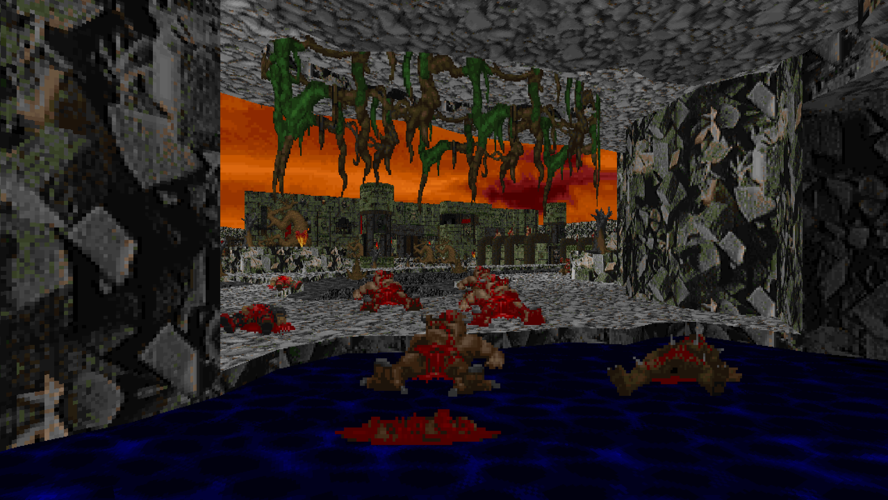
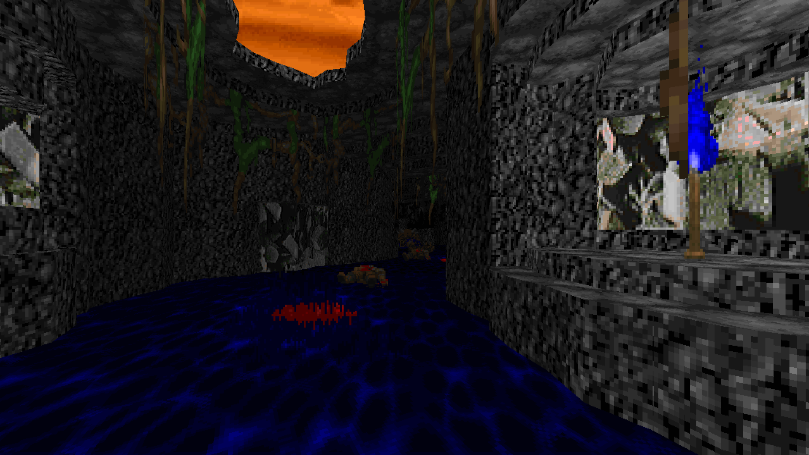
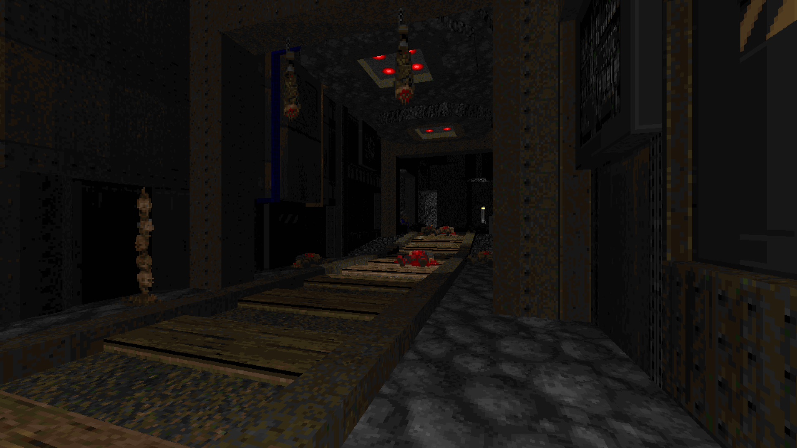
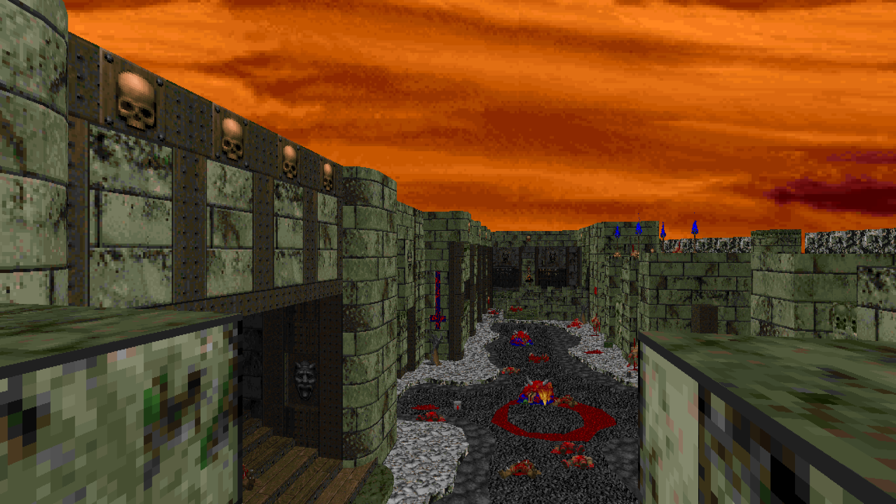
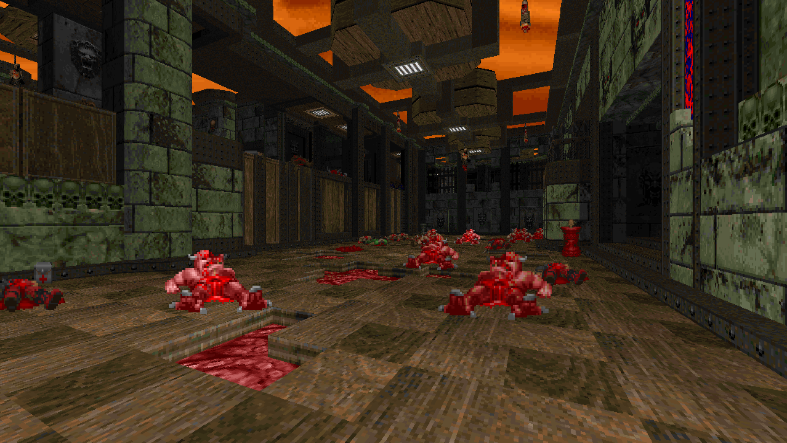

# Citadel (1 level, MBF 2.03 complevel, Ultimate Doom)
# STATUS: ✅RELEASED

**Download**: [Latest Release](https://github.com/Ear1h/WAD-Citadel/releases/download/v1.1/JOPA_Citadel.wad)

The map was inspired by map08 and map11 from Alien Vendetta. You must infiltrate the citadel through an abandoned mine and through a great infernal lake. Build Time: August 06 - August 26

### Version 1.1
### Additions  
- Added a few more enemies  
- Set the **AMBUSH** flag for certain actors  

### Screenshots

